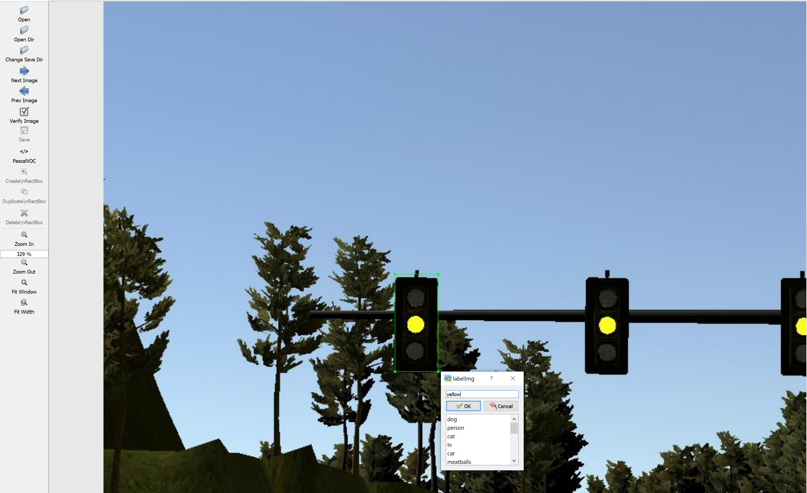
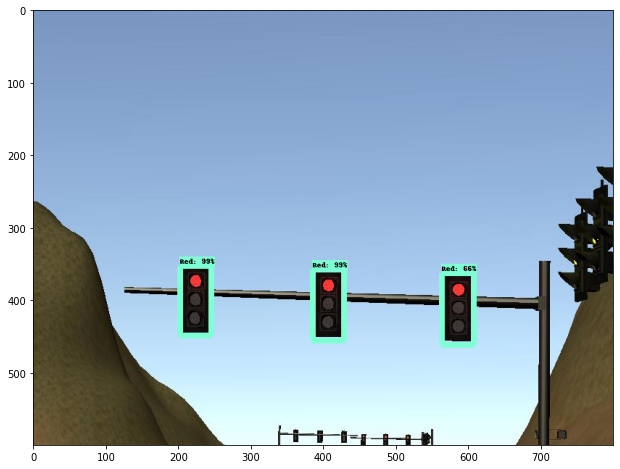
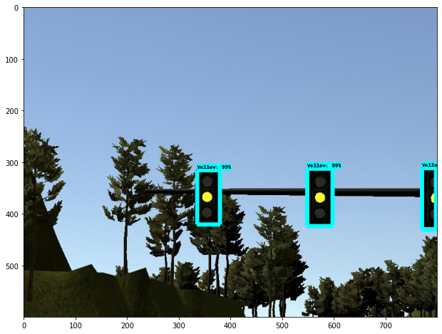
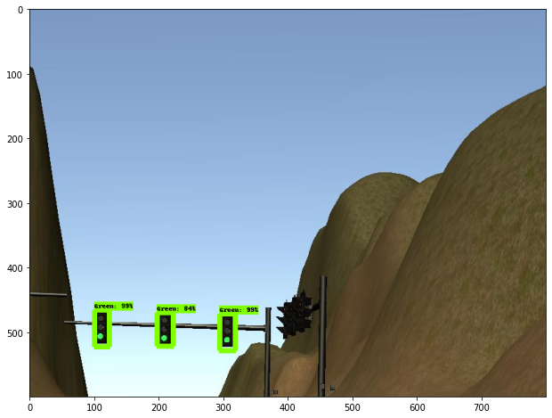

# Custom Traffic Light State Detector 

A custom object detection model was trained to detect the state of traffic lights for the Udacity Self-Driving Capstone Project. The goal of the detector is to allow a self driving car to detect the states of traffic lights and react accordingly. 

## Sample Result:

The object detection algorithm is running in the background ensuring that the car decelerates to a stop when a red light is detected within critical distance. This object detection model is trained using the Custom Object Detection API offered by TensorFlow.

## Tensorflow Model Detection Zoo

Tensorflow has provided a collection of detection models pre-trained on the COCO dataset and many other datasets. These pre-trained models can be useful for out-of-the-box inference if the categories of interests was already in those datasets. For example, the [COCO dataset](http://cocodataset.org/#explore) has 80 different object categories in it. TensorFlow has trained on various different object detection algorithms such as SSD and Faster-RCNN, providing all of these models for free at their [github page](https://github.com/tensorflow/models/blob/master/research/object_detection/g3doc/detection_model_zoo.md).

It is important to note that traffic lights is actually one of COCO object category. However, if we were to directly use this pre-trained COCO model, there will be a requirement to:

1. Extract out the image of the traffic light based on bounding boxes given.
2. Pass these the images of the traffic light into a classification network.

Therefore, it will be wiser to train the object detection algorithm to immediately distinguish the state of the traffic lights (red,green,yellow) in a single pass. This reduces the computational power required as there is no need for an add-on classifcation network. 

# Custom Object Detection

To customized and train the object detection algorithm (implementation given at `training_custom_object_detection.ipynb`):

1. We will first need to **collect our own image dataset** to retrain the models given in the model detection zoo. In this case, simulation images of traffic light and traffic light images from udacity Carla was collected for training.

2. **Label the images accordingly**. We have to annotate the dataset by putting bounding boxes for the object of interest. I used [labelImg](https://github.com/tzutalin/labelImg), a free to used and convenient image labeller. Example of manual labelling:

The labelImg application provides you with XML files for your labels. You can convert the XML files to csv using the script `xml_to_csv.py`. It output from the labelImg basically helps you relate each image file name to the coordinate of the bounding box and classication label. TensorFlow Object Detection API uses TFRecord files to keep track of the images and its label. Therefore, we will need to conver the csv files we have made into TFRecords through `generate_tfrecords.py`. Remember to edit lines `30-39` of `generate_tfrecords.py` to your own object labels.

3. TensorFlow requires **a label map file in the form of .pbtxt**. This is very easy to make, just open notepad and copy my `training/label_map.pbtxt` file. Edit it according to your own object categories.

4. **[Download the pretrained model](https://github.com/tensorflow/models/blob/master/research/object_detection/g3doc/detection_model_zoo.md)** that you wish to use. In my case, I went with the `ssd_mobilenet_v2_coco` as I want it to run at least 30 FPS to given more time for the car to check and react.

5. In this pretrained model file, **find the .config file and edit the configurations to suit your own system** (checkout `training/ssd_mobilenet_v2_coco.config`). There are only 4 things that you have to edit from the .config file. Edit the number of classes (`line 3`). In my case, 3 classes for red,yellow and green light. Edit the fine_tune_checkpoint pathway (`line 158`). Edit the pathway to your training and testing dataset TFRecord files. (`line 165,178`). Edit pathway to label map, .pbtxt file. (`line 163,174`).

6. **Train the model**. I personally do not have the resources to train the model. I used Colaboratory which is a free to used cloud GPU/TPU service provided by Google which is why my training script is a python notebook under `training_custom_object_detection.ipynb`. If you copy paste my script, you should be good to go in terms of getting all of the required dependencies. I saved all of my files into Google Drive and then mounted it on Colaboratory for access. 

Personal experience with Colaboratory is that you have to supervise the training, clicking into it every 10-15 minutes sometimes to prevent runtime disconnection. Some days I do not experience runtime disconnection (unless you overload the limit provided - 12 hours). My models took 2.5 hours to trained with Colab GPU. 

## Inference

After training the model, you will have frozen inference graph containing the entire neural network model with all of its parameters. To run the inference, all you will need is the frozen trained model with the ssd model folder and the label_map.pbtxt. Check out `Traffic_LightState_Detector.ipynb` to learn how to run the inference and check the inference speed.

## Samples results

Click into the images for a clearer look:

Red Light                  |  Yellow Light    | Green Light
:-------------------------:|:-------------------------:|:-------------------------:
   |  | 
